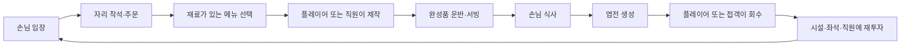

# 01. 핵심 플레이 루프

## 1. 목적

이 문서는 영업 화면에서 이용자가 반복하는 행동, 자동화가 개입하는 순서, 화면 피드백과 완료 조건을 정의한다.

## 2. 영업의 기본 루프



## 3. 조작 원칙

### 3.1 이용자가 직접 하는 입력

- HUD 밖의 플레이 영역을 짧게 탭하면 주인공이 해당 월드 위치로 이동한다.
- 시설이 목적지를 가로막으면 자동으로 우회하고, 시설 내부를 탭하면 가장 가까운 접근 가능 위치까지 이동한다.
- 캐릭터 방향 표현은 실제 이동 속도의 우세 축을 사용해 4방향을 유지한다.
- 같은 플레이 영역을 8픽셀 이상 드래그하면 이동 명령 없이 카메라가 스테이지 경계 안에서 움직인다. 카메라는 자동 추적, 회전, 확대·축소를 하지 않는다.
- 이동 중 카메라를 드래그해도 기존 목적지는 유지되며 새 탭은 이전 목적지를 교체한다.
- 입력은 모바일 터치를 기준으로 하며 키보드 이동은 제공하지 않는다. PC 검증에서는 마우스 클릭과 드래그가 터치를 대신한다.
- 낮 화면 오른쪽 아래 해금·업그레이드 UI에서 좌석과 메뉴를 구매한다.
- 새벽 시장에서 구매 패드 위에 1초간 머물러 재료 묶음을 산다.
- 정산, 구매 완료, 준비 완료와 같은 단계 전환은 명시적 버튼으로 확정한다.

### 3.2 접근 시 자동으로 실행되는 작업

- 손님에게서 주문 한 건 받기
- 현재 메뉴 동선에 포함된 주방 스테이션 방문
- 조리대에서 주문한 초밥 한 접시 만들기
- 완성된 접시 들기
- 주문한 손님에게 전달
- 바닥의 엽전 회수
- 새벽 준비대에서 세척·손질·보관

반복 생산을 위해 별도 제작 버튼을 누르거나 화면을 연타하게 하지 않는다.
영업 주방은 메뉴 수와 관계없이 `생선류`, `밥`, `기타요리`, `조리대` 네 스테이션만 사용한다. 새 메뉴는 스테이션을 추가하지 않고 네 스테이션 중 필요한 경로를 정의한다.

- 고등어 초밥: `생선류 → 밥 → 조리대`
- 계란 초밥: `기타요리 → 밥 → 조리대`
- 튀김처럼 별도 재료 방문이 필요 없는 메뉴: `조리대`

앞 단계를 건너뛰거나 경로 밖 스테이션에 접근해도 상태와 재고는 바뀌지 않는다. 음식은 항상 마지막 조리대에서 완성된다. 접객이 없으면 주인공이 완성 접시를 들고, 접객이 있으면 접객이 조리대에서 가져간다.

### 3.3 상호작용 우선순위

한 범위에 여러 대상이 겹치면 다음 순서로 처리한다.

1. 현재 들고 있는 물건을 내려놓을 수 있는 목적지
2. 주문이 있는 손님
3. 완성품
4. 필요한 재료
5. 엽전

이 우선순위는 이용자 의도와 충돌하는 사례가 발견되면 조정한다. 프로토타입에서는 화면 표시로 현재 선택된 대상을 보여준다.

## 4. 생산 단위

MVP의 생산 단위는 **접시 1개**다.

- 고등어 초밥 1접시: 밥 1인분 + 손질 고등어 1인분
- 계란 초밥 1접시: 밥 1인분 + 손질 계란 1인분
- 주문은 한 번에 한 건만 들 수 있고 주문 없이 재료를 가져갈 수 없다.
- 경로 뒤쪽에 필요한 재료가 부족하면 앞쪽 스테이션에서도 재료가 차감되지 않아 불완전한 준비 상태를 만들지 않는다.
- 고등어는 생선류, 계란은 기타요리, 밥은 밥 스테이션에 접근할 때 각각 한 인분씩 차감된다.
- 작업 범위를 떠나면 진행 중인 접시의 게이지는 멈추며, 다시 접근하면 소비한 재료와 진행도를 유지한 채 이어서 만든다.
- 완성된 접시는 해당 주문과 연결돼 조리대에서 완성된다. 접객이 없으면 주인공이 즉시 수령하며, 접객이 있으면 접객이 예약해 수령한다.
- 플레이어와 직원이 같은 작업을 노리면 먼저 예약한 쪽이 완료하거나 취소할 때까지 소유한다. 직원은 목표로 이동하기 전에 주문·완성 접시·결제를 예약하고, 플레이어는 접근 범위에서 실제 상호작용을 시작할 때 예약한다. 나중에 먼저 도착하더라도 진행 중인 작업을 빼앗지 않는다.
- 주문이 생성되면 필요한 밥과 토핑 한 인분을 논리적으로 예약한다. 실제 재고 차감은 각 재료 스테이션에 도착했을 때 한 번만 수행하며, 예약량을 제외한 사용 가능 재고가 없으면 다음 주문을 만들지 않는다.
- 한 손님은 한 번에 1접시만 주문한다.
- 복수 주문, 세트 메뉴, 테이블 합석은 제외한다.

## 5. 화면에서 보여야 하는 상태

| 상태 | 필수 피드백 |
|---|---|
| 주문 대기 | 손님 머리 위 메뉴 아이콘 |
| 재료 부족 | 조리대 위 빨간 재료 아이콘과 `품절` |
| 제작 중 | 짧은 원형 진행 표시 |
| 완성품 대기 | 조리대 위 접시가 실제로 쌓임 |
| 서빙 대기 | 주문 아이콘이 가볍게 점멸 |
| 결제 완료 | 엽전이 좌석 옆에 생성 |
| 업그레이드 가능 | 오른쪽 아래 해금 버튼에 구매 가능 표시 |
| 업그레이드 불가 | 부족 금액 표시, 연속 경고음 금지 |

숫자 HUD가 없어도 “재료 부족”, “제작 밀림”, “서빙 밀림” 중 무엇이 문제인지 구분돼야 한다.

## 6. 자동화 진행

### 단계 0 — 주인 혼자 운영

주인공이 제작, 운반, 서빙, 엽전 회수를 모두 맡는다. 첫 2~3분 동안 바쁨과 동선 선택을 경험하게 한다.

### 단계 1 — 접객 고용

접객은 다음 행동을 자동으로 반복한다.

```text
주문 접수 → 조리대 완성품 수령 → 해당 손님에게 서빙 → 돈 계산
```

접객은 주방 재료 처리와 조리를 하지 않는다. 역할이 한눈에 명확해야 한다.
접객이 예약한 주문·완성 접시·결제는 이동 중에도 플레이어가 가져갈 수 없다. 경로를 찾지 못하거나 대상이 사라지거나 접객이 퇴사하면 예약을 즉시 해제한다.

### 단계 2 — 주방장 고용

주방장은 플레이어나 접객이 받은 주문을 메뉴 경로대로 자동 처리하고 최종 조리대에 완성한다. 접객이 함께 있으면 조리대에서 바로 이어받아 서빙하며, 접객이 없으면 주인공이 완성품을 수령한다.

### 단계 3 — 시설 성능 향상

메뉴 레벨과 좌석 수가 늘면서 처리량과 수요가 함께 증가한다.

### 고용과 주급

- 주방장 주급: 60문
- 접객 주급: 45문
- 첫 주급은 고용 시 선불로 지불한다.
- 다음 주급일은 고용일로부터 7일 뒤이며, 이후 7일마다 갱신한다.
- 지급일에 보유금이 부족하면 해당 직원이 퇴사한다.
- 고용 여부, 주급, 다음 지급일은 저장되는 게임 상태다.

## 7. 업그레이드 루프

### 해금

- 좌석과 메뉴 해금·강화는 오른쪽 아래 고정 버튼에서 연다.
- 직원은 낮 화면 왼쪽 아래 고정 버튼에서 고용한다.
- 항목마다 필요한 엽전과 해금 결과를 함께 보여준다.
- 좌석은 결제 즉시 설치되고, 메뉴는 결제 즉시 신규 손님의 주문 후보에 반영된다.
- Stage 01 정산에서는 500문을 모아 Stage 02의 더 넓은 장소를 살 수 있다. 장소 이전은 메뉴 해금과 메뉴 레벨만 유지하고 나머지 운영 상태를 초기화한다.

### 강화

- 고등어 메뉴: 제작 시간 감소 + 판매가 상승
- 계란 메뉴: 제작 시간 감소 + 판매가 상승
- 좌석: 레벨 강화 없이 새 좌석만 추가

한 업그레이드가 두 개 이상의 수치를 바꾸더라도 화면 문구는 가장 체감되는 효과 하나를 우선 표시한다.

## 8. 수요와 대기

- 손님은 입구에서 생성돼 빈 좌석으로 이동한다.
- 빈 좌석이 없으면 최대 3명까지 대기한다.
- 주문 후 40초가 지나면 손님은 결제 없이 떠난다.
- 떠난 손님에 대한 평판 감소나 추가 벌점은 없다.
- 모든 판매 가능 재료가 소진되고 진행 중 주문도 없으면 `오늘 재료가 모두 떨어졌습니다`를 표시하고 조기 정산할 수 있다.

MVP에는 만족도 수치나 별점 시스템을 넣지 않는다. 대기 이탈은 병목을 보여주는 단순한 손실로만 사용한다.

## 9. 이용자 선택

영업 중 선택은 세 가지로 제한한다.

1. 지금 어떤 일을 직접 처리할 것인가?
2. 다음 엽전을 어느 시설에 투자할 것인가?
3. 더 많은 좌석으로 수요를 늘릴지, 생산 속도를 먼저 높일 것인가?

메뉴 가격 직접 설정, 직원 배치표, 재료별 생산 우선순위는 MVP에서 제외한다. 직원은 역할별 한 명으로 제한한다.

## 10. 핵심 루프 수용 기준

- 새 게임 시작 후 30초 안에 첫 접시를 판매할 수 있다.
- 별도 제작 버튼 없이 접근만으로 제작과 서빙이 완료된다.
- 주문, 제작, 완성, 서빙, 결제 상태를 화면에서 구분할 수 있다.
- 접객을 고용한 뒤 10초 안에 주문·서빙·계산 자동화를 확인할 수 있다.
- 주방장을 고용하고 주문을 받으면 네 스테이션 경로를 따라 자동 조리해 조리대에 완성한다.
- 주방장과 접객을 함께 고용하면 주문부터 결제까지 플레이어 작업 없이 한 판매를 완료한다.
- 좌석이 늘어날수록 손님 처리량과 병목이 실제로 변한다.
- 재료 부족 시 해당 메뉴만 멈추며 게임 전체가 멈추지 않는다.
- 엽전이 부족한 업그레이드는 결제되지 않고 현재 상태를 보존한다.
- Stage 01 정산에서 장소 구매 비용이 부족하면 부족 금액을 표시하고, 충분하면 메뉴 해금·레벨만 유지한 Stage 02 Day 1로 전환한다.
- 10분 연속 플레이에서 주문이 영구 정지하거나 손님이 좌석에 갇히는 현상이 없다.
