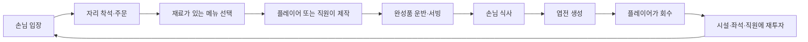

# 01. 핵심 플레이 루프

## 1. 목적

이 문서는 영업 화면에서 이용자가 반복하는 행동, 자동화가 개입하는 순서, 화면 피드백과 완료 조건을 정의한다.

## 2. 영업의 기본 루프



## 3. 조작 원칙

### 3.1 이용자가 직접 하는 입력

- 화면에 고정된 상·하·좌·우 버튼을 누르는 동안 주인공이 이동한다.
- 두 방향 버튼을 함께 누르면 대각선으로 이동한다. 캐릭터 방향 표현은 이동 벡터의 우세 축을 사용해 4방향을 유지한다.
- 입력은 모바일 터치를 기준으로 하며 키보드 이동은 제공하지 않는다. PC 검증에서는 방향 버튼의 마우스 클릭 유지가 터치를 대신한다.
- 이동 UI 밖의 플레이 영역을 드래그하면 카메라가 스테이지 경계 안에서 움직인다. 카메라는 자동 추적, 회전, 확대·축소를 하지 않는다.
- 이동 버튼과 카메라 드래그는 서로 다른 터치 포인터로 동시에 사용할 수 있다.
- 해금 패드와 업그레이드 패드 위에 머물러 엽전을 지불한다.
- 새벽 시장에서 구매 패드 위에 1초간 머물러 재료 묶음을 산다.
- 정산, 구매 완료, 준비 완료와 같은 단계 전환은 명시적 버튼으로 확정한다.

### 3.2 접근 시 자동으로 실행되는 작업

- 재료 집기
- 조리대에서 초밥 만들기
- 완성된 접시 들기
- 주문한 손님에게 전달
- 바닥의 엽전 회수
- 새벽 준비대에서 세척·손질·보관

반복 생산을 위해 별도 제작 버튼을 누르거나 화면을 연타하게 하지 않는다.

### 3.3 상호작용 우선순위

한 범위에 여러 대상이 겹치면 다음 순서로 처리한다.

1. 현재 들고 있는 물건을 내려놓을 수 있는 목적지
2. 주문이 있는 손님
3. 완성품
4. 필요한 재료
5. 엽전
6. 해금·업그레이드 패드

이 우선순위는 이용자 의도와 충돌하는 사례가 발견되면 조정한다. 프로토타입에서는 화면 표시로 현재 선택된 대상을 보여준다.

## 4. 생산 단위

MVP의 생산 단위는 **접시 1개**다.

- 고등어 초밥 1접시: 밥 1인분 + 손질 고등어 1인분
- 계란 초밥 1접시: 밥 1인분 + 손질 계란 1인분
- 한 손님은 한 번에 1접시만 주문한다.
- 복수 주문, 세트 메뉴, 테이블 합석은 제외한다.

## 5. 화면에서 보여야 하는 상태

| 상태 | 필수 피드백 |
|---|---|
| 주문 대기 | 손님 머리 위 메뉴 아이콘 |
| 재료 부족 | 조리대 위 빨간 재료 아이콘과 `품절` |
| 제작 중 | 짧은 원형 진행 표시 |
| 완성품 대기 | 조리대 위 접시가 실제로 쌓임 |
| 서빙 대기 | 주문 아이콘이 가볍게 점멸 |
| 결제 완료 | 엽전이 좌석 옆에 생성 |
| 업그레이드 가능 | 패드 가격이 밝아지고 약한 반짝임 |
| 업그레이드 불가 | 부족 금액 표시, 연속 경고음 금지 |

숫자 HUD가 없어도 “재료 부족”, “제작 밀림”, “서빙 밀림” 중 무엇이 문제인지 구분돼야 한다.

## 6. 자동화 진행

### 단계 0 — 주인 혼자 운영

주인공이 제작, 운반, 서빙, 엽전 회수를 모두 맡는다. 첫 2~3분 동안 바쁨과 동선 선택을 경험하게 한다.

### 단계 1 — 첫 점원 고용

점원은 다음 행동을 자동으로 반복한다.

```text
완성품 탐색 → 해당 주문 손님에게 이동 → 서빙 → 다음 완성품 탐색
```

점원은 재료 손질, 초밥 제작, 엽전 회수를 하지 않는다. 역할이 한눈에 명확해야 한다.

### 단계 2 — 시설 성능 향상

조리대 레벨과 좌석 수가 늘면서 처리량과 수요가 함께 증가한다. MVP Stage 01에서는 자동 조리 장인을 추가하지 않는다. 플레이어의 핵심 작업이 완전히 사라지는 것을 막고 콘텐츠 수를 제한하기 위한 결정이다.

자동 조리 직원은 후속 스테이지 후보로만 기록한다.

## 7. 업그레이드 루프

### 해금

- 아직 없는 좌석, 점원, 계란 조리대는 바닥 패드로 표시한다.
- 패드에 필요한 엽전과 해금 결과의 작은 그림을 함께 보여준다.
- 가격을 모두 지불하면 즉시 설치되고 사용할 수 있다.

### 강화

- 고등어 조리대: 제작 시간 감소 + 판매가 상승
- 계란 조리대: 제작 시간 감소 + 판매가 상승
- 점원: 이동 속도 상승
- 좌석: 레벨 강화 없이 새 좌석만 추가

한 업그레이드가 두 개 이상의 수치를 바꾸더라도 화면 문구는 가장 체감되는 효과 하나를 우선 표시한다.

## 8. 수요와 대기

- 손님은 입구에서 생성돼 빈 좌석으로 이동한다.
- 빈 좌석이 없으면 최대 3명까지 대기한다.
- 주문 후 40초가 지나면 손님은 결제 없이 떠난다.
- 떠난 손님에 대한 평판 감소나 추가 벌점은 없다.
- 모든 판매 가능 재료가 소진되고 진행 중 주문도 없으면 `오늘 재료가 모두 떨어졌습니다`를 표시하고 조기 정산할 수 있다.

MVP에는 만족도 수치나 별점 시스템을 넣지 않는다. 대기 이탈은 병목을 보여주는 단순한 손실로만 사용한다.

## 9. 이용자 선택

영업 중 선택은 세 가지로 제한한다.

1. 지금 어떤 일을 직접 처리할 것인가?
2. 다음 엽전을 어느 시설에 투자할 것인가?
3. 더 많은 좌석으로 수요를 늘릴지, 생산 속도를 먼저 높일 것인가?

메뉴 가격 직접 설정, 직원 배치표, 재료별 생산 우선순위는 MVP에서 제외한다.

## 10. 핵심 루프 수용 기준

- 새 게임 시작 후 30초 안에 첫 접시를 판매할 수 있다.
- 별도 제작 버튼 없이 접근만으로 제작과 서빙이 완료된다.
- 주문, 제작, 완성, 서빙, 결제 상태를 화면에서 구분할 수 있다.
- 점원을 고용한 뒤 10초 안에 “서빙이 자동화됐다”는 사실을 알 수 있다.
- 좌석이 늘어날수록 손님 처리량과 병목이 실제로 변한다.
- 재료 부족 시 해당 메뉴만 멈추며 게임 전체가 멈추지 않는다.
- 엽전이 부족한 업그레이드는 결제되지 않고 현재 상태를 보존한다.
- 10분 연속 플레이에서 주문이 영구 정지하거나 손님이 좌석에 갇히는 현상이 없다.
