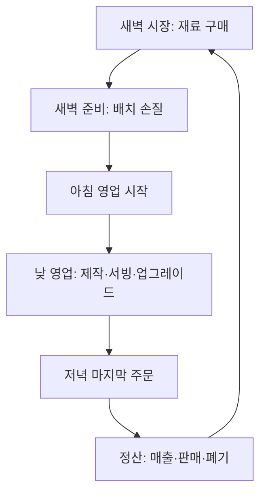

# 02. 하루 진행 구조

## 1. 설계 목적

하루 구조는 빠른 영업 루프에 준비와 결과의 연결을 더한다. 영업이 메인이고 새벽 준비는 다음 영업의 규모를 결정하는 짧은 보조 파트다.

## 2. 첫날 예외

첫 실행은 새벽 시장이 아니라 **아침 영업**에서 시작한다.

### 초기 지급 상태

- 고등어용 밥 20인분
- 손질된 고등어 20인분
- 생선류·밥·기타요리·조리대 스테이션 각 1개
- 손님 좌석 1개
- 주인공 1명
- 엽전 0문

이용자는 구매와 손질 설명을 보기 전에 첫 손님을 받는다. 첫날은 준비 시스템을 숨기고 제작, 서빙, 회수, 업그레이드, 직원 고용만 학습한다.

## 3. 일반 하루 순서



첫날만 `아침 영업 → 저녁 정산 → 새벽 시장` 순서로 진입한다.

## 4. 권장 시간

| 구간 | 초기값 | 상한 |
|---|---:|---:|
| 첫날 영업과 튜토리얼 | 5분 30초 | 6분 |
| 둘째 날 이후 영업 | 5분 | 6분 |
| 정산 | 10~15초 | 20초 |
| 새벽 구매·손질 | 60~90초 | 2분 |
| 일반 하루 전체 | 약 6~7분 | 8분 |

새벽 준비가 2분을 넘는 사례가 반복되면 작업 수나 이동 거리를 줄인다. 준비를 길게 만들어 플레이 시간을 확보하지 않는다.

## 5. 새벽 시장

### 5.1 화면 정보

- 보유 엽전
- 어제 판매한 메뉴별 수량
- 어제 품절 또는 폐기된 수량
- 오늘 예상 손님 범위
- 현재 구매한 밥·고등어·계란 인분

예상 손님은 정확한 정답 대신 `오늘 약 18~22명 예상`처럼 범위로 보여준다.

### 5.2 구매 방식

- 재료는 5인분 묶음으로 판매한다.
- 구매 패드 위에 1초간 머물면 한 묶음을 산다.
- 같은 패드에 계속 서 있어도 연속 구매는 1초마다 한 번만 발생한다.
- 시장을 나가기 전에는 `되돌리기`로 이번 시장에서 산 재료를 전액 환불할 수 있다.
- `구매 완료`를 누르면 환불할 수 없고 준비 파트로 넘어간다.

### 5.3 구매 대상

- 쌀 5인분 묶음
- 고등어 5인분 묶음
- 계란 초밥 해금 후 계란 5인분 묶음

랜덤 가격, 상인별 품질, 흥정은 없다.

## 6. 재료 손질

손질은 개별 재료가 아니라 **구매한 묶음 전체를 한 번에 처리하는 배치 작업**이다.

### 고등어 준비

```text
상자 운반 → 세척대 → 손질대 → 얼음 상자
```

### 쌀 준비

```text
쌀가마 운반 → 씻기 → 밥 짓기 → 밥통
```

### 계란 준비

```text
바구니 운반 → 화로 조리 → 식히기 → 보관함
```

각 작업대에 접근하면 진행 게이지가 자동으로 찬다. 이용자는 순서와 이동만 담당한다. 칼질 연타나 타이밍 판정은 없다.

### 준비 완료 조건

- 구매한 쌀 중 최소 5인분을 준비했다.
- 판매할 토핑 중 하나를 최소 5인분 준비했다.
- 처리 중인 배치가 없다.

모든 구매량을 손질하지 않아도 `준비 완료`할 수 있지만, 미처리 재료는 다음 영업에 사용할 수 없다.

## 7. 재료 수명

MVP에서는 신선도 게이지를 사용하지 않는다.

- 새벽에 준비한 재료는 당일 영업에만 사용한다.
- 영업 종료 후 남은 준비 재료는 자동 폐기된다.
- 폐기량과 손실액은 정산 화면에 표시한다.
- 구매했지만 손질하지 않은 재료도 당일 종료 시 폐기된다.

이는 신선도 시스템이 아니라 하루 구매량 선택을 의미 있게 만드는 단순 규칙이다.

## 8. 영업 종료

다음 중 하나가 충족되면 저녁 정산으로 이동한다.

- 영업 타이머 종료 후 현재 손님의 식사가 끝남
- 모든 판매 가능 재료가 소진되고 진행 중 주문이 없음
- 이용자가 조기 마감 버튼을 2초간 눌러 확정

타이머 종료 후에는 새 손님을 받지 않는다. 이미 주문한 손님은 마지막 접시까지 처리할 수 있다.

## 9. 정산 화면

정산은 한 화면에서 20초 안에 이해할 수 있어야 한다.

### 필수 항목

- 총매출
- 판매한 총접시
- 메뉴별 판매량
- 기다리다 떠난 손님 수
- 남아 폐기한 재료 수와 원가
- 새로 해금한 항목
- 다음 날 예상 손님 범위

첫날 정산에서만 `내일 장사할 재료를 사러 갑니다` 안내를 보여준다.

## 10. 첫 두 날의 경험

### Day 1

```text
준비된 재료로 첫 판매
→ 고등어 메뉴 강화
→ 좌석 2 해금
→ 접객 또는 주방장 고용
→ 저녁 정산
```

### Day 1 이후 새벽

```text
어제 판매량 확인
→ 쌀과 고등어를 5인분 단위로 구매
→ 세척·손질·밥 준비
→ 준비 완료
```

### Day 2

```text
준비한 수량만큼 영업
→ 품절 또는 폐기 결과 확인
→ 계란 메뉴 또는 세 번째 좌석 해금 선택
```

## 11. 하루 구조 수용 기준

- 새 게임에서 시장 설명 없이 바로 영업을 시작한다.
- 첫 정산까지 평균 6분 안에 도달한다.
- 첫 정산 후 시장과 손질을 거쳐 2분 안에 Day 2를 시작할 수 있다.
- 구매량, 준비량, 판매 가능량이 서로 일치한다.
- 재료 1인분을 판매하면 밥 1과 해당 토핑 1이 정확히 차감된다.
- 남은 재료가 정산의 폐기량과 일치한다.
- 모든 재료가 소진돼도 조기 정산을 통해 다음 날로 진행할 수 있다.
- 시장 구매를 잘못해도 구매 완료 전에는 전액 되돌릴 수 있다.
- 낮 영업은 30초마다 단일 슬롯에 자동 저장되며, 게임을 다시 열면 마지막 낮 자동 저장 또는 정산 완료 상태에서 복구된다.
- 새벽 시장과 준비 중에는 메뉴와 저장 기능이 없으므로, 이때 종료하면 직전 낮 저장 상태에서 다시 시작한다.
